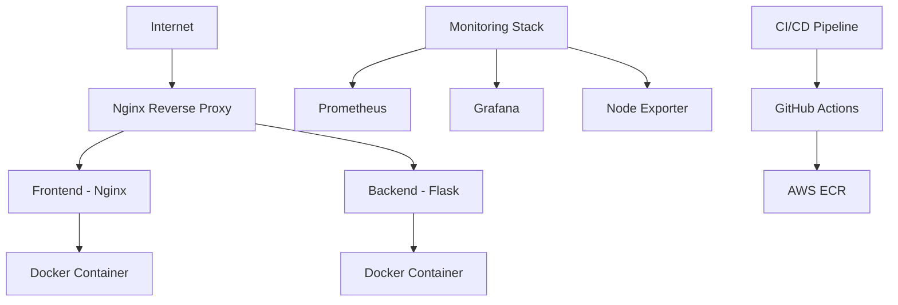
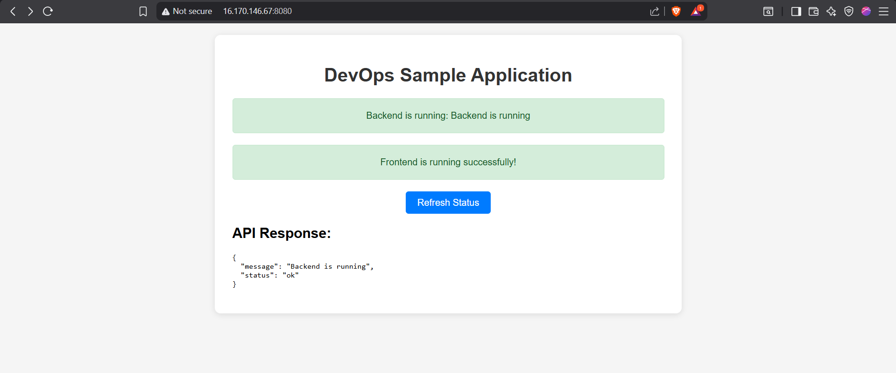
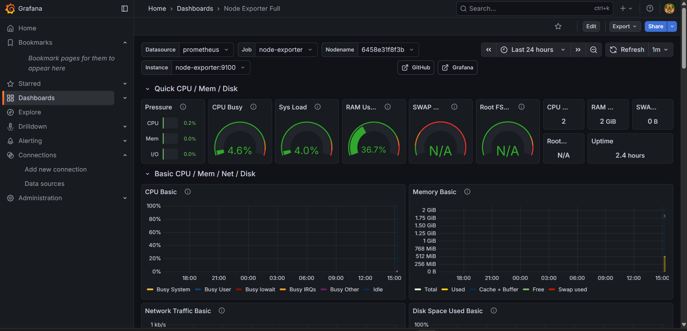
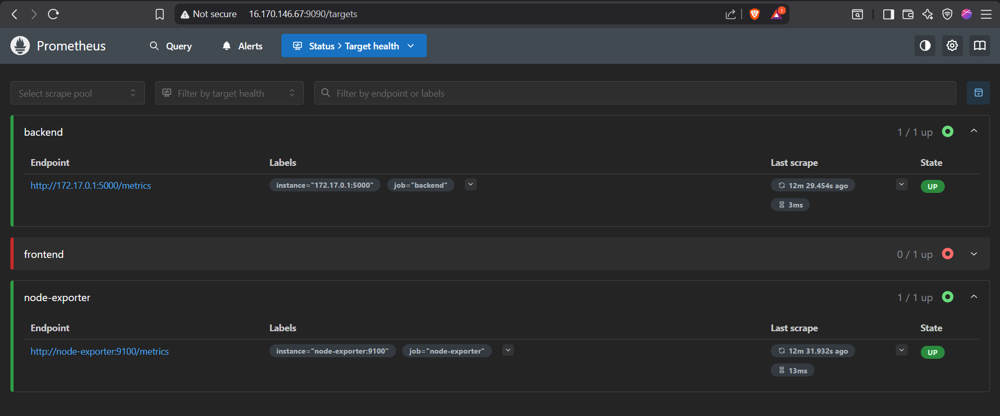
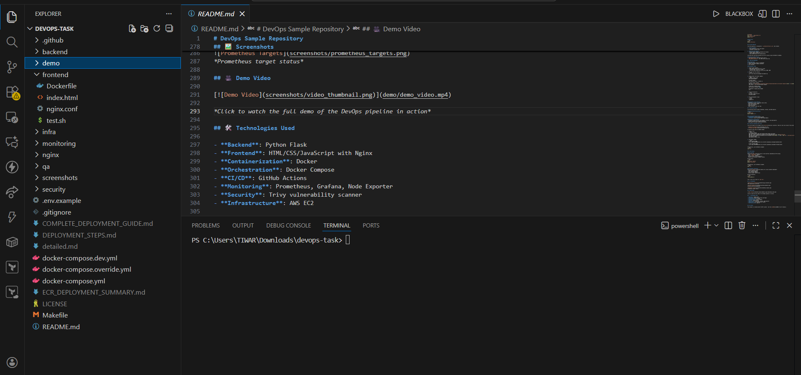

# DevOps Sample Repository

A complete, production-ready DevOps pipeline with backend, frontend, CI/CD, monitoring, and security components.

## 🏗️ Architecture Diagram



## 📁 Folder Structure

```
├── backend/
│   ├── app.py              # Flask application
│   ├── Dockerfile          # Backend Docker configuration
│   ├── requirements.txt    # Python dependencies
│   └── tests/              # Unit tests
├── frontend/
│   ├── index.html          # Main HTML file
│   ├── Dockerfile          # Frontend Docker configuration
│   └── nginx.conf          # Nginx configuration
├── infra/
│   ├── deploy.sh           # Deployment script
│   └── nginx/
│       └── default.conf    # Nginx reverse proxy config
├── monitoring/
│   ├── docker-compose.yml  # Monitoring services
│   └── prometheus.yml      # Prometheus configuration
├── security/
│   ├── backend_scan.txt    # Trivy scan report placeholder
│   └── frontend_scan.txt   # Trivy scan report placeholder
├── qa/
│   ├── test_api.py         # API testing script
│   └── test_deploy.sh      # Deployment validation
├── pipelines/
├── .github/workflows/
│   └── ci.yml              # CI/CD pipeline
├── docker-compose.yml      # Main docker-compose
├── docker-compose.override.yml  # Override configuration
└── nginx/
    └── default.conf        # Reverse proxy configuration
```

## 🚀 Quick Start

1. Clone the repository:
   ```bash
   git clone <repository-url>
   cd devops-sample
   ```

2. Run locally with Docker Compose:
   ```bash
   docker-compose -f docker-compose.dev.yml up --build
   ```

3. Access the applications:
   - Frontend: http://localhost:8080
   - Backend API: http://localhost:8080/api/status
   - Backend Health: http://localhost:8080/health

## 🧪 Running Tests

### Backend Tests
```bash
cd backend
pip install -r requirements.txt
pip install pytest
pytest tests/
```

### API Tests
```bash
cd qa
python test_api.py
```

## 🔄 CI/CD Pipeline

The CI/CD pipeline is configured in `.github/workflows/ci.yml` and includes:

1. **Testing Stage**:
   - Runs backend unit tests with pytest
   - Validates frontend files

2. **Build and Push Stage**:
   - Builds Docker images for backend and frontend
   - Pushes images to AWS ECR
   - Uses GitHub Secrets for authentication

### Required GitHub Secrets:
- `AWS_ACCESS_KEY_ID`: Your AWS access key ID
- `AWS_SECRET_ACCESS_KEY`: Your AWS secret access key

## ☁️ AWS EC2 Deployment

### Prerequisites
1. AWS EC2 instance (Ubuntu recommended)
2. Docker and Docker Compose installed
3. Git installed

### Deployment Steps

1. Launch an EC2 instance:
   - AMI: Ubuntu Server 20.04 LTS or later
   - Instance Type: t2.micro or larger
   - Security Group: Open ports 22, 80, 443, 9090, 3000

2. SSH into your EC2 instance:
   ```bash
   ssh -i your-key.pem ubuntu@your-ec2-public-ip
   ```

3. Install Docker and Docker Compose:
   ```bash
   # Update package index
   sudo apt-get update
   
   # Install Docker
   sudo apt-get install -y docker.io
   
   # Install Docker Compose
   sudo curl -L "https://github.com/docker/compose/releases/download/v2.20.2/docker-compose-$(uname -s)-$(uname -m)" -o /usr/local/bin/docker-compose
   sudo chmod +x /usr/local/bin/docker-compose
   
   # Add user to docker group
   sudo usermod -aG docker $USER
   
   # Reconnect to apply group changes
   exit
   ```

4. Clone the repository:
   ```bash
   git clone <repository-url>
   cd devops-sample
   ```

5. Run the deployment script:
   ```bash
   cd infra
   ./deploy.sh
   ```

### Deployment Script Features
- Idempotent: Can be run multiple times safely
- Pulls latest Docker images
- Stops old containers
- Starts new stack
- Shows container status and logs

## 📊 Monitoring Setup

The monitoring stack includes Prometheus, Grafana, and Node Exporter.

### Running Monitoring Services
```bash
cd monitoring
docker-compose -f docker-compose.dev.yml up -d
```

### Accessing Monitoring Tools
- **Prometheus**: http://localhost:9090
- **Grafana**: http://localhost:3000 (admin/admin)

### Monitoring Configuration
- Prometheus scrapes metrics from backend, frontend, and node-exporter
- Grafana includes pre-configured dashboards
- Node Exporter provides system-level metrics

## 🔒 Security Scanning with Trivy

Trivy scan reports are included as placeholders in the [security](security/) directory:

- [Backend Scan Report](security/backend_scan.txt)
- [Frontend Scan Report](security/frontend_scan.txt)

To perform actual scans:

1. Install Trivy:
   ```bash
   # For Ubuntu/Debian
   sudo apt-get install wget apt-transport-https gnupg lsb-release
   wget -qO - https://aquasecurity.github.io/trivy-repo/deb/public.key | sudo apt-key add -
   echo deb https://aquasecurity.github.io/trivy-repo/deb $(lsb_release -sc) main | sudo tee -a /etc/apt/sources.list.d/trivy.list
   sudo apt-get update
   sudo apt-get install trivy
   ```

2. Scan Docker images:
   ```bash
   # Scan backend image
   trivy image YOUR_AWS_ACCOUNT_ID.dkr.ecr.us-east-1.amazonaws.com/sample-backend:latest
   
   # Scan frontend image
   trivy image YOUR_AWS_ACCOUNT_ID.dkr.ecr.us-east-1.amazonaws.com/sample-frontend:latest
   ```

## 🧪 QA Testing

### API Testing
The [qa/test_api.py](qa/test_api.py) script performs comprehensive API testing:
- Tests `/api/status` endpoint
- Tests `/health` endpoint
- Verifies static file availability
- Measures and validates response latency

Run the tests:
```bash
cd qa
pip install requests
python test_api.py
```

### Deployment Validation
The [qa/test_deploy.sh](qa/test_deploy.sh) script validates deployment:
- Checks container status
- Tests backend endpoint
- Tests frontend endpoint
- Verifies nginx reverse proxy

Run the validation:
```bash
cd qa
./test_deploy.sh
```

## 🖼️ Screenshots


*Main application interface*


*Grafana monitoring dashboard*


*Prometheus target status*

## 🎥 Demo Video

[](demo/demo_video.mp4)

*Click to watch the full demo of the DevOps pipeline in action*

## 🛠️ Technologies Used

- **Backend**: Python Flask
- **Frontend**: HTML/CSS/JavaScript with Nginx
- **Containerization**: Docker
- **Orchestration**: Docker Compose
- **CI/CD**: GitHub Actions
- **Monitoring**: Prometheus, Grafana, Node Exporter
- **Security**: Trivy vulnerability scanner
- **Infrastructure**: AWS EC2

## 📄 License

This project is licensed under the MIT License - see the [LICENSE](LICENSE) file for details.